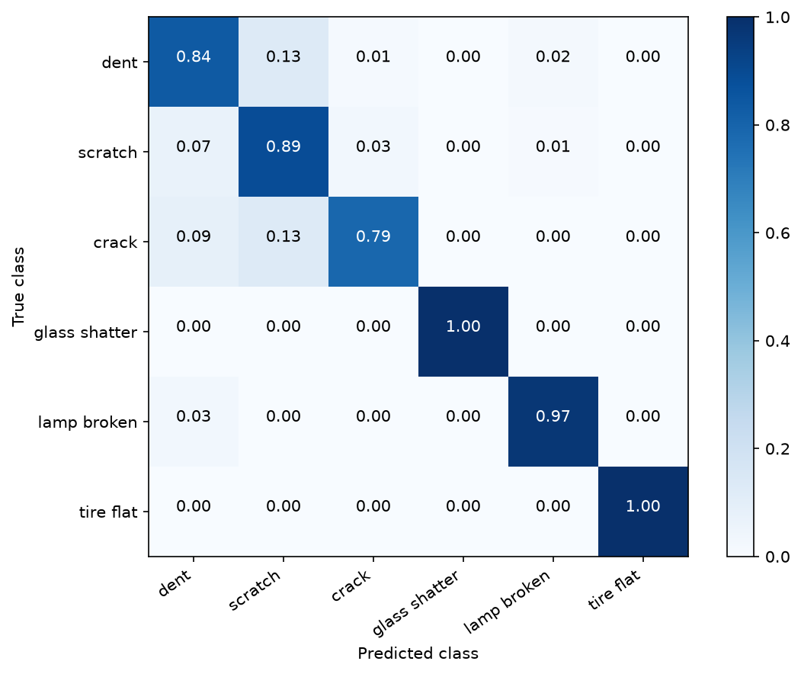
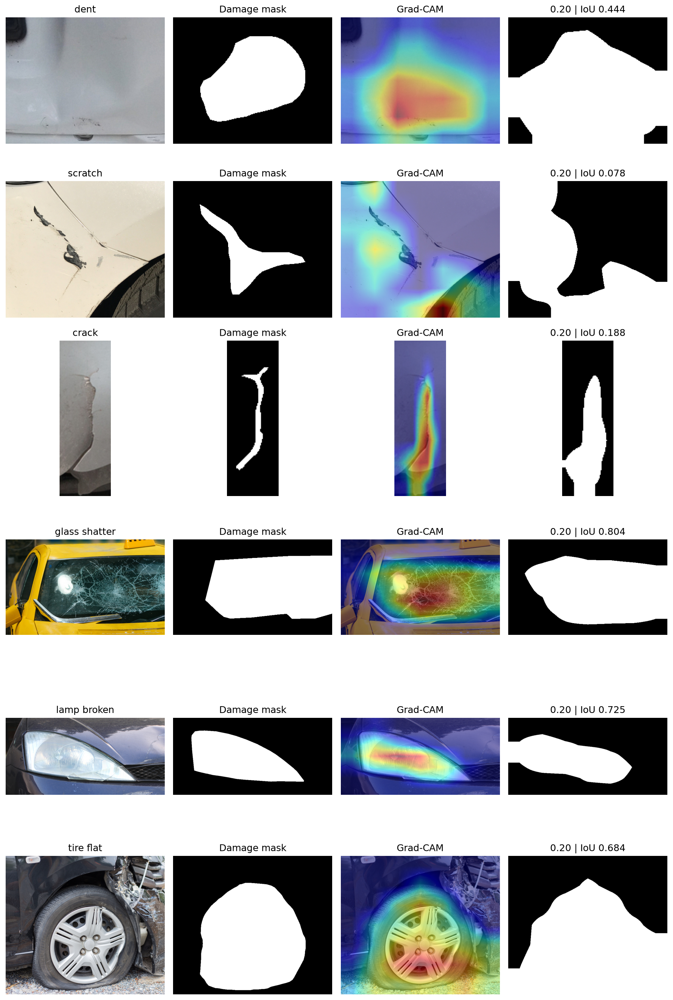
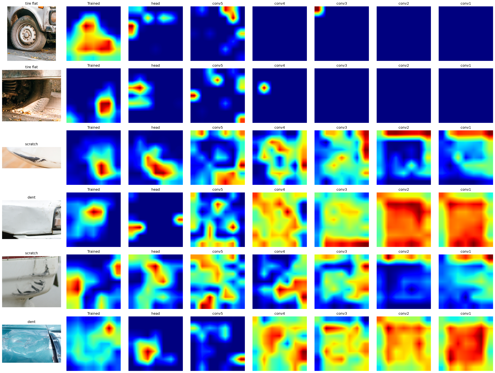

# Explainable Vehicle Damage Classification

**An evaluation of Grad-CAM using the CarDD dataset**

Train a vehicle damage classifier, visualize its predictions, and evaluate how closely its explanations match annotated damage.

[Workflow](#workflow) · [Dataset](#dataset) · [Results](#results) · [Grad-CAM localization](#grad-cam-localization) · [Sanity check](#parameter-randomization-sanity-check)

---

## Workflow

| Step | Notebook | Purpose |
| :---: | :--- | :--- |
| **01** | [Data preparation](notebooks/data_prep.ipynb) | Validate annotations and prepare damage-crop manifests. |
| **02** | [Training](notebooks/training.ipynb) | Train ResNet50 and select the Grad-CAM threshold on validation data. |
| **03** | [Evaluation](notebooks/evaluation.ipynb) | Evaluate classification, explanation localization, and parameter sensitivity on the test set. |

### 01 · Data preparation

The notebook loads images and **COCO-format annotations** from the existing training, validation, and test splits. It checks image readability, image dimensions, duplicate identifiers, category references, bounding boxes, and segmentation masks.

Each damage annotation becomes a **separate classification sample**. The code expands its bounding box by **25% on each side**, clips the crop to the image boundaries, and uses identical coordinates for the corresponding damage mask.

It saves a **sample manifest**, **class-index mapping**, and **crop configuration**. Image crops are extracted from the original files later using the manifest.

### 02 · Training

The notebook reads the prepared manifest and trains an **ImageNet-pretrained ResNet50** classifier. Images are resized to **224 × 224** and processed with ResNet50's input preprocessing. Training images receive horizontal flips, small rotations, and contrast augmentation. **Class weights** calculated from training samples address the unequal class distribution.

Training takes place in two stages:

1. **Classification head · 15 epochs:** train the head with the backbone frozen.
2. **Fine-tuning · 20 epochs:** fine-tune ResNet50's final convolutional stage while keeping batch-normalization layers frozen.

The final checkpoint is selected by the **lowest validation loss** across both stages.

Grad-CAM heatmaps explain the **ground-truth class** and are compared with the selected annotation's mask using **intersection over union (IoU)** and the **pointing game**. The notebook selects a heatmap threshold from **19 candidates (0.05–0.95)** using validation IoU. A small, class-balanced parameter-randomization check examines whether explanations depend on learned model weights.

### 03 · Evaluation

The notebook loads the saved model, training configuration, and **validation-selected threshold**. It verifies dataset file hashes and evaluates classification and Grad-CAM localization on **every test crop**. It also generates explanation galleries and repeats the parameter-randomization check across the full test set. Reports, predictions, heatmaps, and evaluation settings are saved for subsequent analysis.

> **Evaluation scope:** Localization results assess explanations within annotated crops; they do not measure full-image damage detection.

## Dataset

| Split | Source images | Damage samples |
| :--- | ---: | ---: |
| Training | 2,816 | 6,211 |
| Validation | 810 | 1,744 |
| Test | 374 | 785 |
| **Total** | **4,000** | **8,740** |

---

## Results

### Classification performance

| Test metric | Score |
| :--- | ---: |
| **Accuracy** | **88.66%** |
| Macro precision | 90.79% |
| Macro recall | 91.42% |
| **Macro F1** | **91.06%** |

Performance was strongest for **glass shatter** and **tire flat**, and weakest for **crack**. The confusion matrix showed that **dent** and **scratch** were most frequently confused.

  
   
  <em>Figure 1 · Test-set confusion matrix.</em>

### Grad-CAM localization

| Localization metric | Value |
| :--- | ---: |
| Validation-selected threshold | 0.2 |
| **Mean test IoU** | **0.3854** |
| Whole-crop baseline IoU | 0.3146 |
| IoU improvement | 7.08 percentage points |
| **Pointing-game accuracy** | **69.55%** |
| Informative heatmaps | 99.75% |
| Test crops | 785 |

These results indicate **partial alignment** between the highlighted regions and annotated damage: the strongest heatmap point fell within the damage mask in approximately **seven out of ten crops**. Mean IoU exceeded the whole-crop baseline by **7.08 percentage points**.

  
   
  <em>Figure 2 · Grad-CAM explanation gallery on the test set.</em>

### Parameter-randomization sanity check

The sanity check showed **low heatmap correlations across all six stages**, with mean Spearman correlations ranging from **−0.053 to 0.130**. Mean absolute heatmap differences generally increased as progressively deeper layers were randomized, rising from **0.238** after head randomization to **0.342** at conv2, before decreasing to **0.310** at conv1.

These findings support that the Grad-CAM explanations **depend on learned model parameters**. However, informative heatmap coverage declined from **99.36% to 87.01%**, and correlations were calculated only for defined comparisons.

> **Interpretation:** The sanity check supports parameter sensitivity. Localization accuracy is assessed separately through IoU and the pointing game.

  
   
  <em>Figure 3 · Heatmap changes during parameter randomization.</em>

